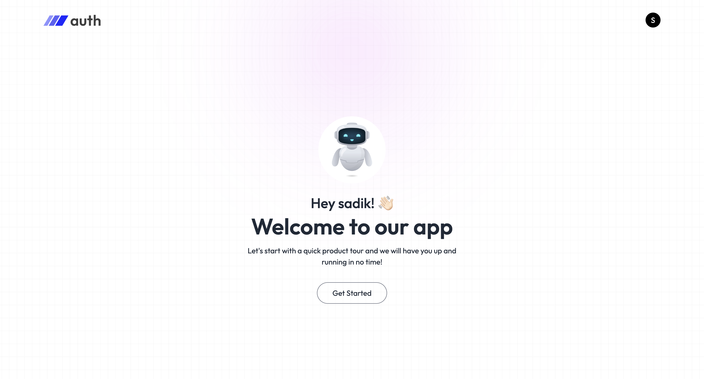
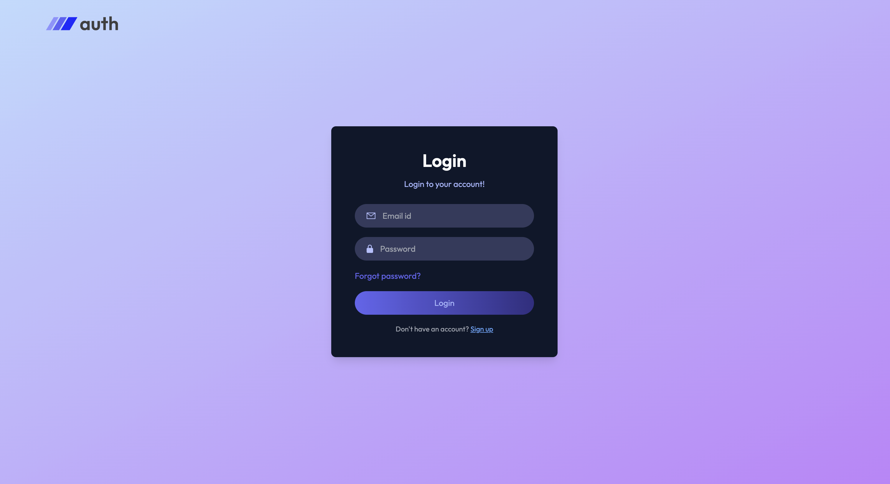
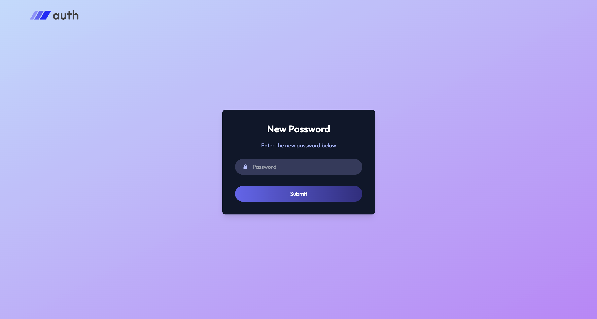
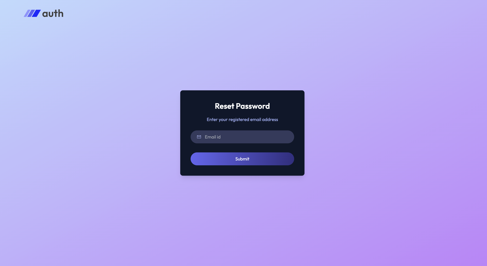
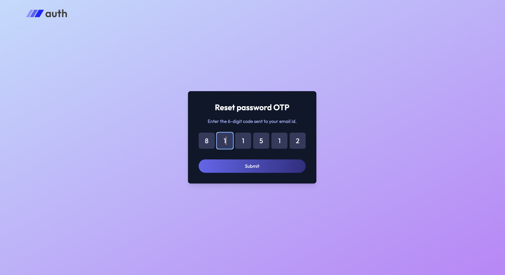
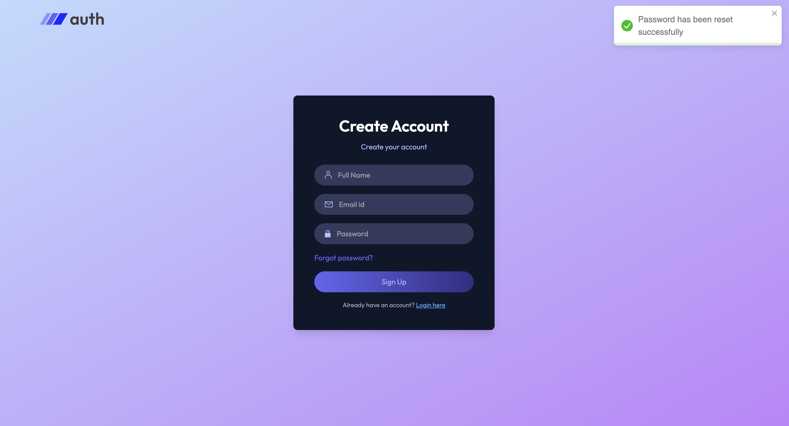
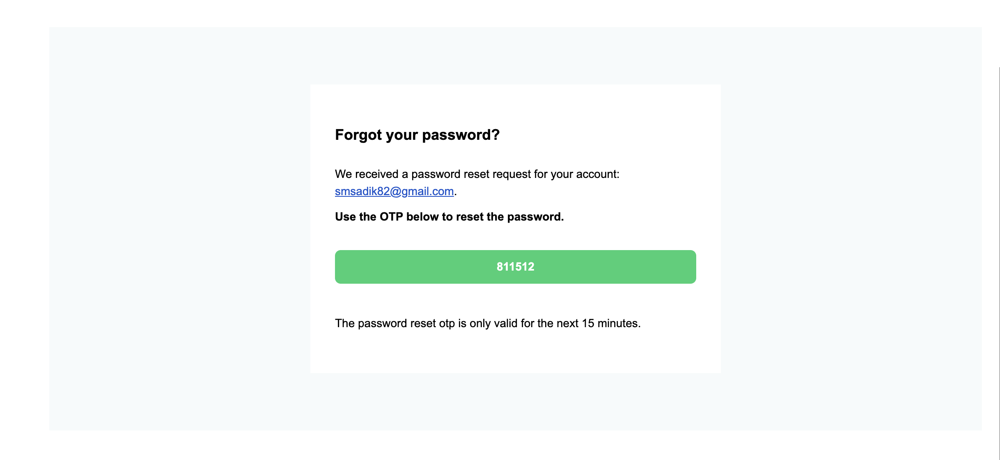

# MERN Authentication System (Email Verification + Password Reset with OTP)

This project is a complete Authentication System built using the MERN Stack (MongoDB, Express, React, Node.js).
It includes secure Email Verification, Login, Registration, and Password Reset using a 6-digit OTP sent to the user's email address.
The backend uses JWT (JSON Web Tokens) for secure authentication, while the frontend is built using React + Tailwind CSS.

---

# Features
## 🛡️Authentication

User Registration with Email Verification

Login using JWT

Secure Password Hashing (bcrypt)

Protected Routes for authenticated users

## ✉️ Email OTP System

6-digit OTP sent to user’s email

OTP verification with expiry

Resend OTP functionality

Email templates for better UX

## 🔐 Password Reset

Password reset with email-based OTP

OTP verification for password change

Secure update of user password

## 🖥️ Frontend (React + Tailwind)

Registration Form

Login Form

OTP Verification Form

Password Reset Request Form

New Password Update Form

Responsive UI using Tailwind CSS

## 🧩 Tech Stack

**Frontend:** React, Axios, Tailwind CSS
**Backend:** Node.js, Express.js, MongoDB, Mongoose
**Authentication:** JWT, bcrypt
**Email Service:** Nodemailer
**Utilities:** dotenv, cookie-parser, cors

---

## Installation Instructions  

1. **Clone the repository**  
   ```bash
   git@github.com:shiblesadik603/Mern_-Authentication_System.git
   cd Mern_-Authentication_System

## Install dependencies  

1. **For backend:**  
   ```bash
   cd backend
   npm install

2. **For frontend:**  
   ```bash
   cd frontend
   npm install

## Run the App Locally  

1. **Start backend server:**  
   ```bash
   npm run server

2. **Start frontend:**  
   ```bash
   npm run dev

## Screenshots











